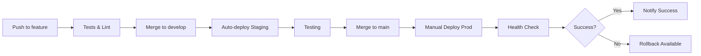

# GitLab CI/CD Setup Guide for AudioTricks

## 🚀 Overview

This GitLab CI/CD pipeline automates:
- ✅ Building frontend and backend
- ✅ Running tests and linting
- ✅ Security scanning
- ✅ Automated deployment to staging
- ✅ Manual deployment to production
- ✅ Rollback capabilities
- ✅ Slack/Email notifications

## 📋 Prerequisites

### 1. GitLab Variables to Set

Go to **Settings → CI/CD → Variables** and add:

```bash
# SSH Keys (Protected)
STAGING_SSH_KEY      # Private SSH key for staging server
PRODUCTION_SSH_KEY   # Private SSH key for production server

# Server Details (Protected)
STAGING_HOST         # staging.audiotricks.com
STAGING_USER         # audiotricks
PRODUCTION_HOST      # audiotricks.com  
PRODUCTION_USER      # audiotricks

# Notifications
SLACK_WEBHOOK_URL    # https://hooks.slack.com/services/xxx
ALERT_EMAIL          # alerts@yourdomain.com
GMAIL_USER           # your-email@gmail.com
GMAIL_APP_PASSWORD   # Gmail app-specific password
```

### 2. Server SSH Setup

On each server (staging/production):

```bash
# As the audiotricks user
mkdir -p ~/.ssh
chmod 700 ~/.ssh

# Add GitLab's public key to authorized_keys
echo "ssh-rsa YOUR_GITLAB_DEPLOY_KEY" >> ~/.ssh/authorized_keys
chmod 600 ~/.ssh/authorized_keys
```

### 3. Protected Branches

Configure in **Settings → Repository → Protected branches**:
- `main` - Maintainers can push, developers can merge
- `develop` - Developers can push and merge

## 🔄 Workflow

### Development Flow

1. **Feature Branch**
   ```bash
   git checkout -b feature/new-feature
   # Make changes
   git push origin feature/new-feature
   ```

2. **Merge Request to `develop`**
   - Runs tests, linting, security scan
   - Reviews required
   - Auto-deploys to staging on merge

3. **Merge to `main`**
   - Creates production-ready build
   - Manual deployment trigger required
   - Rollback available if needed

### Deployment Flow



## 🛠️ Pipeline Stages Explained

### 1. Build Stage
- Installs dependencies
- Builds frontend assets
- Generates Prisma client
- Creates artifacts for deployment

### 2. Test Stage
- Runs frontend tests with coverage
- Runs backend tests with test database
- Performs linting checks
- Security dependency scanning

### 3. Deploy Stage
- **Staging**: Automatic on develop branch
- **Production**: Manual trigger on main branch
- Creates backup before deployment
- Runs database migrations
- Zero-downtime deployment with PM2
- Health check validation

### 4. Notify Stage
- Slack notification on success
- Email alert on failure
- Includes deployment details

## 🔧 Advanced Features

### Rollback Procedure

If deployment fails:

1. Go to **CI/CD → Pipelines**
2. Find the main branch pipeline
3. Click **"rollback:production"** job
4. Click **"Play"** button

This will:
- Find the latest backup
- Restore previous version
- Restart application

### Environment URLs

The pipeline sets up environment URLs:
- **Staging**: https://staging.audiotricks.com
- **Production**: https://audiotricks.com

Access via **Operations → Environments**

### Custom Deployment

For hotfixes or custom deployments:

```yaml
# Add to .gitlab-ci.yml
deploy:hotfix:
  extends: deploy:production
  only:
    - /^hotfix\/.*$/
  when: manual
```

## 📊 Monitoring Pipeline

### View Pipeline Status
- **CI/CD → Pipelines**: See all pipeline runs
- **CI/CD → Jobs**: Detailed job logs
- **Operations → Environments**: Deployment history

### Pipeline Badges

Add to README.md:
```markdown
[](https://gitlab.com/yourgroup/audiotricks/-/commits/main)
[](https://gitlab.com/yourgroup/audiotricks/-/commits/main)
```

## 🚨 Troubleshooting

### SSH Connection Failed
```bash
# Test SSH connection
ssh -i deploy_key audiotricks@server -v
```

### Pipeline Timeout
Increase in `.gitlab-ci.yml`:
```yaml
deploy:production:
  timeout: 30 minutes
```

### Cache Issues
Clear cache in **CI/CD → Pipelines** → **Clear Runner Caches**

## 🔐 Security Best Practices

1. **Protected Variables**: Mark all sensitive variables as protected
2. **Masked Variables**: Mask secrets in job logs
3. **Environment Scoping**: Limit variables to specific environments
4. **SSH Key Rotation**: Rotate deploy keys quarterly
5. **Audit Logs**: Review deployment logs regularly

## 📈 Performance Optimization

### Runner Configuration
For faster builds, use:
- GitLab Runner with Docker executor
- Dedicated runner for production deployments
- Cache Docker layers

### Parallel Jobs
```yaml
test:
  parallel:
    matrix:
      - TEST_SUITE: frontend
      - TEST_SUITE: backend
      - TEST_SUITE: integration
```

## 🎯 Next Steps

1. **Set up GitLab Runner** (if self-hosted)
2. **Configure variables** in GitLab
3. **Test staging deployment** first
4. **Monitor initial deployments** closely
5. **Set up alerts** for failed pipelines